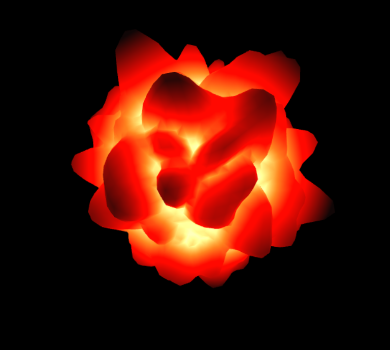
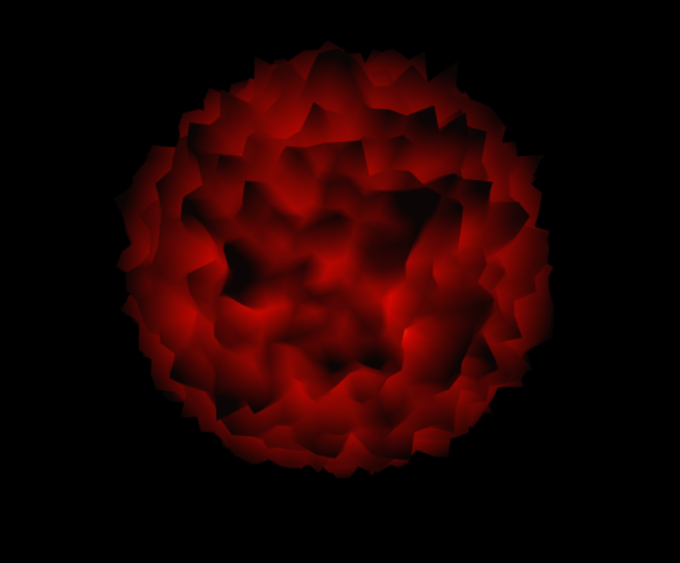
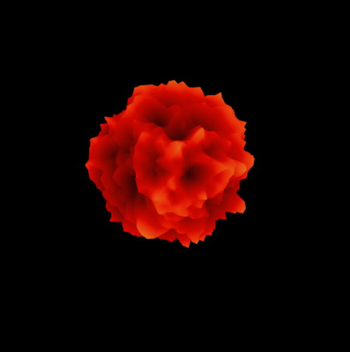
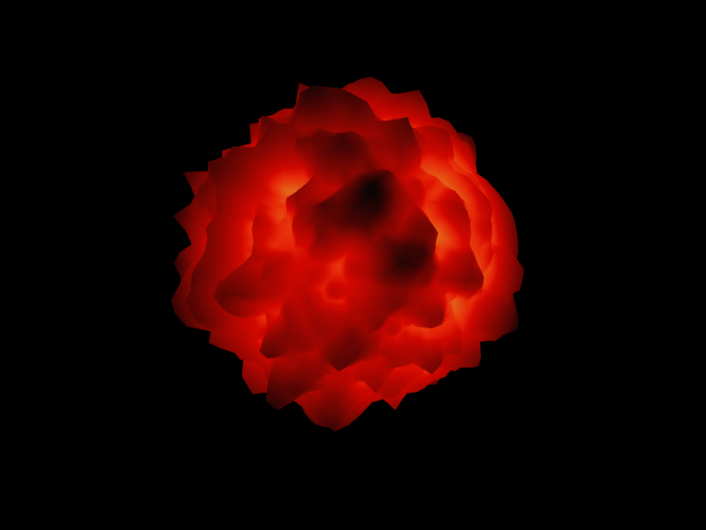
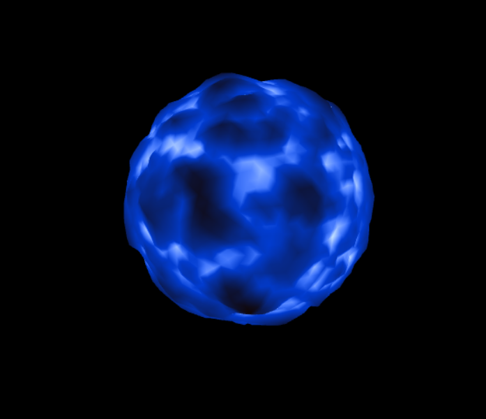
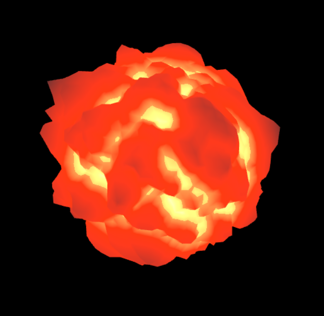
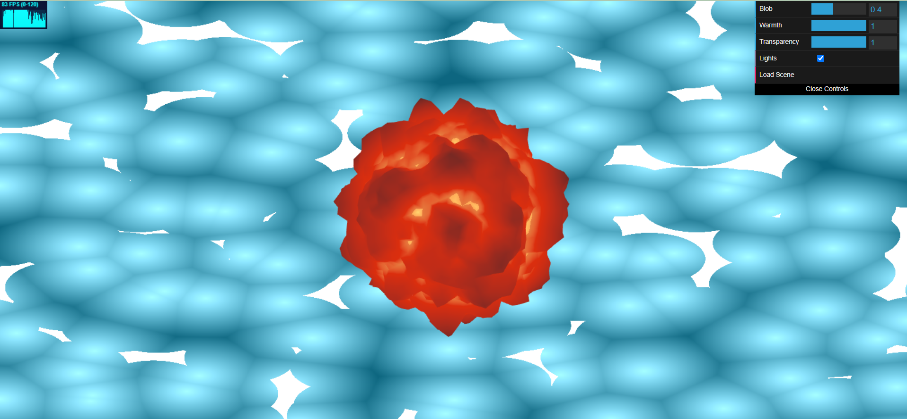
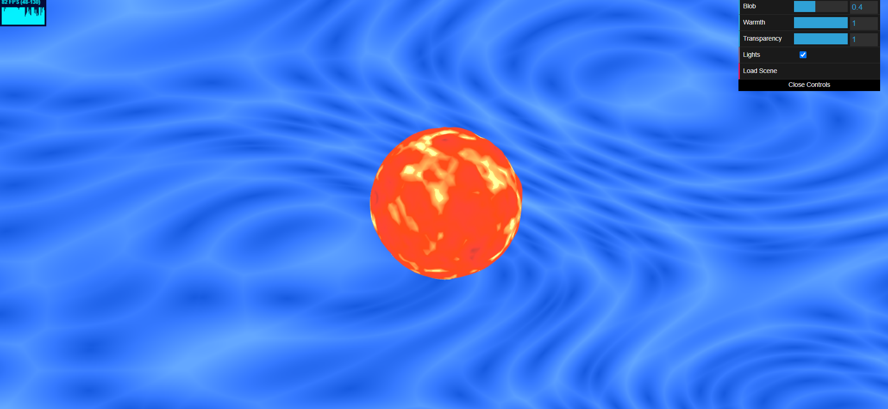
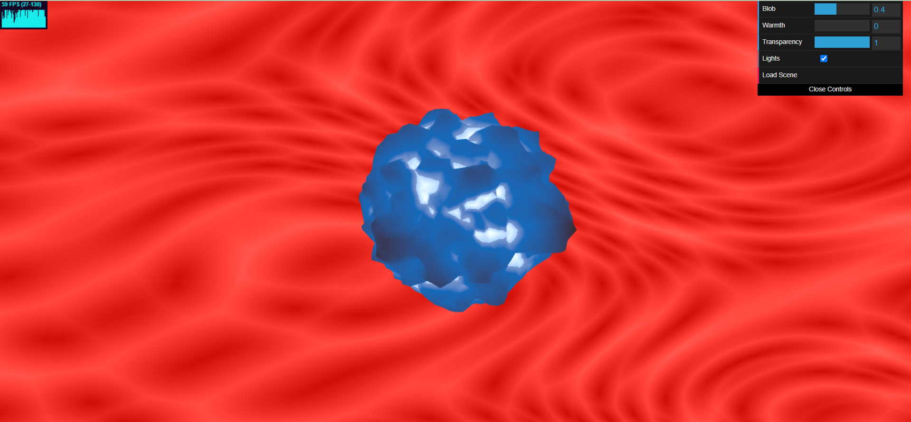

# [Project 1: Noise](https://github.com/CIS-566-Fall-2022/hw01-fireball-base)

https://viviviantung.github.io/hw01-fireball-base/

hello

The first step I took to modify the sphere was implementing simplex noise to alter the shape. I took inspo from this blobby firey ball https://www.clicktorelease.com/blog/vertex-displacement-noise-3d-webgl-glsl-three-js/ and used the simplex noise from Ashima Arts https://github.com/ashima/webgl-noise/blob/master/src/noise3D.glsl. I then found shades of White, Yellow, Red, and Black that I thought looked good and mixed them together using the mix() function.

I then, to add a higher frequency lower amplitude noise on top of the simplex noise and to make it less blobby, I interpolated the simplex noise with fbm noise. The "Blob" feature in the GUI changes the interpolation between the two noises. I ended up doing this as one of the dials on the GUI because I kinda like the blobby look of the fireball and wanted to see the difference between completely simplex and completely fbm.

 

After that, I wanted to incorporate an even higher amplitude function that very visibly changed the shape of the ball as a whole, and I also wanted to use sin/cos functions somewhere in the project. So by playing around with a sin function that manipulates the size of the entire ball, I got an effect that changes the ball from a smaller, spiky shape to a bigger shape where the bumps of the noise can really be seen. But after this, I thought that the transition between the two states was the most interesting part (because it kinda like a smoke ball expanding to me), so I played around with a gain function in order for the ball to spend more time in the transition state.

 

I also wanted to see if I could pulse the colors to obtain a slight flashing effect. I created a pulse function in the fragment shader of the fireball and, through playing around with the numbers, I feel like the ball nonuniformly goes from a dull color to a brighter color.

At this point was when I started adding attributes in the GUI so that you could change the "Warmth" of the fireball, which changes the interpolation of the color of the ball from reds to blues. I also added an alpha channel and created the "Transparency" dial in the GUI. Right now I don't really understand why when alpha = 0 the ball is black because I thought it should interpolate with the colors of what's behind the ball. I still want to play with that and see if I can fix that. I also wonder if it's possible to put a smaller sphere within the fireball so that when I decrease alpha, you could be able to see the different layers. But currently I think if you were to decrease alpha, it would just become black, and you wouldn't see object within it.

I also tried to create a bloom filter on the fireball, because I thought it would be cool if the ball could glow. I dug around in my 460 OpenGL Fun code to see if I could implement it. However, after putting it in the fragment shader of the fireball, I realized that bloom is a post-process shader and that implementing it solely on the fireball would not make it glow. So now the ball just gets a little brighter haha. I think it's still kinda coolish, so I made a checkbox in the GUI that turns it on and off, mostly so I could see the difference. But I do want to make a post process bloom effect if I were to develop the project further.

For the background, I had the idea of making it an abstract interpretation of water, since we were making a fireball... and water is the opposite of fire... and it's a symbol of opposing forces interacting and coming together... and I thought it would be fun to do worley noise. (https://godotshaders.com/snippet/voronoi/) After implementing the worley bubbly-looking shapes, I thought that water has that white foam on top of it, so I layered another worley noise on top and had out_Col output white when that noise > 0.8, so that only the outlines of the bubbles would show. I found a different noise implementation like right before I started typing this (https://i1.wp.com/www.data-imaginist.com/post/2020-03-18-a-noisy-start_files/figure-html/unnamed-chunk-7-1.png?w=450&ssl=1) that looks cool and watery and I want to try it if I have time.

UPDATE: I've changed the background water by pertubing simplex noise with worley noise. I also interpolated between the blue bubbly noise with a darker blue background to get what is currently my background. I also tried to fix the alpha issue by bringing out the background shader code into the ShaderProgram so that I can include that code into the fireball fragment shader. Now, the alpha channel interpolates between the fireball color and the background color; however, it still only shows one color for the whole ball. I also changed the "Warmth" dial. Now as the fireball gets cooler, the background gets warmer. I figured the hot and cold contrast should persist even as the color of the ball changes.

 

TLDR, this project was a lot of experimenting for me, and although some of the things didn't turn out as aesthetically pleasing as I would've wanted, I enjoyed being able to interpret the project in the way I wanted to and the freedom to try different things.

## Objective

Get comfortable with using WebGL and its shaders to generate an interesting 3D, continuous surface using a multi-octave noise algorithm.

## Getting Started

1. Fork and clone [this repository](https://github.com/CIS700-Procedural-Graphics/Project1-Noise).

2. Copy your hw0 code into your local hw1 repository.

3. In the root directory of your project, run `npm install`. This will download all of those dependencies.

4. Do either of the following (but I highly recommend the first one for reasons I will explain later).

    a. Run `npm start` and then go to `localhost:7000` in your web browser

    b. Run `npm run build` and then go open `index.html` in your web browser

    You should hopefully see the framework code with a 3D cube at the center of the screen!

## Developing Your Code
All of the JavaScript code is living inside the `src` directory. The main file that gets executed when you load the page as you may have guessed is `main.js`. Here, you can make any changes you want, import functions from other files, etc. The reason that I highly suggest you build your project with `npm start` is that doing so will start a process that watches for any changes you make to your code. If it detects anything, it'll automagically rebuild your project and then refresh your browser window for you. Wow. That's cool. If you do it the other way, you'll need to run `npm build` and then refresh your page every time you want to test something.

## Publishing Your Code
We highly suggest that you put your code on GitHub. One of the reasons we chose to make this course using JavaScript is that the Web is highly accessible and making your awesome work public and visible can be a huge benefit when you're looking to score a job or internship. To aid you in this process, running `npm run deploy` will automatically build your project and push it to `gh-pages` where it will be visible at `username.github.io/repo-name`.

## Setting up `main.ts`

Alter `main.ts` so that it renders the icosphere provided, rather than the cube you built in hw0. You will be writing a WebGL shader to displace its surface to look like a fireball. You may either rewrite the shader you wrote in hw0, or make a new `ShaderProgram` instance that uses new GLSL files.

## Noise Generation

Across your vertex and fragment shaders, you must implement a variety of functions of the form `h = f(x,y,z)` to displace and color your fireball's surface, where `h` is some floating-point displacement amount.

- Your vertex shader should apply a low-frequency, high-amplitude displacement of your sphere so as to make it less uniformly sphere-like. You might consider using a combination of sinusoidal functions for this purpose.
- Your vertex shader should also apply a higher-frequency, lower-amplitude layer of fractal Brownian motion to apply a finer level of distortion on top of the high-amplitude displacement.
- Your fragment shader should apply a gradient of colors to your fireball's surface, where the fragment color is correlated in some way to the vertex shader's displacement.
- Both the vertex and fragment shaders should alter their output based on a uniform time variable (i.e. they should be animated). You might consider making a constant animation that causes the fireball's surface to roil, or you could make an animation loop in which the fireball repeatedly explodes.
- Across both shaders, you should make use of at least four of the functions discussed in the Toolbox Functions slides.

## Noise Application

View your noise in action by applying it as a displacement on the surface of your icosahedron, giving your icosahedron a bumpy, cloud-like appearance. Simply take the noise value as a height, and offset the vertices along the icosahedron's surface normals. You are, of course, free to alter the way your noise perturbs your icosahedron's surface as you see fit; we are simply recommending an easy way to visualize your noise. You could even apply a couple of different noise functions to perturb your surface to make it even less spherical.

In order to animate the vertex displacement, use time as the third dimension or as some offset to the (x, y, z) input to the noise function. Pass the current time since start of program as a uniform to the shaders.

For both visual impact and debugging help, also apply color to your geometry using the noise value at each point. There are several ways to do this. For example, you might use the noise value to create UV coordinates to read from a texture (say, a simple gradient image), or just compute the color by hand by lerping between values.

## Interactivity

Using dat.GUI, make at least THREE aspects of your demo interactive variables. For example, you could add a slider to adjust the strength or scale of the noise, change the number of noise octaves, etc. 

Add a button that will restore your fireball to some nice-looking (courtesy of your art direction) defaults. :)

## Extra Spice

Choose one of the following options: 

- Background (easy-hard depending on how fancy you get): Add an interesting background or a more complex scene to place your fireball in so it's not floating in a black void
- Custom mesh (easy): Figure out how to import a custom mesh rather than using an icosahedron for a fancy-shaped cloud.
- Mouse interactivity (medium): Find out how to get the current mouse position in your scene and use it to deform your cloud, such that users can deform the cloud with their cursor.
- Music (hard): Figure out a way to use music to drive your noise animation in some way, such that your noise cloud appears to dance.

## Submission

- Update README.md to contain a solid description of your project
- Publish your project to gh-pages. `npm run deploy`. It should now be visible at http://username.github.io/repo-name
- Create a [pull request](https://help.github.com/articles/creating-a-pull-request/) to this repository, and in the comment, include a link to your published project.
- Submit the link to your pull request on Canvas.
